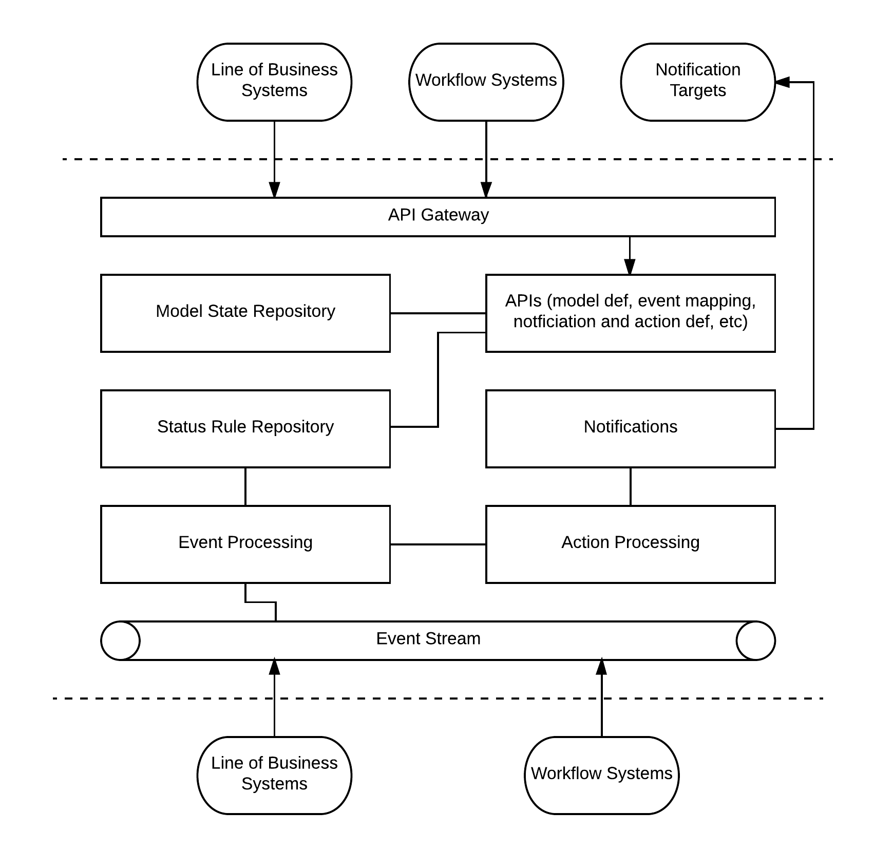

This project implements a generalized status model service, for
maintaining a milestone progression model meant for customer
service request tracking.

The following diagram shows a generalized status tracking architecture.

* Status is related to some end to end service request process instantiated and 
executed by a business on behalf of a customer.
* A model representing the high level sequence of steps or milestones that
must be completed during the service request process for the purpose
of conveying status is used.
* Events emitted by workflow execution or business process orchestration or line
of business systems are fed to the status tracking system, which then correlates
the events to specific service request instantiations, advancing the state of the
service request model instantiated for the service request based on rules.
* Based on model state changes and rules, notifications of status change can be
delivered to systems or customers through different channels - web hooks, mobile 
push notifications, email, etc.
* Also based on model state change and rules, the status notification system may also
emit events to an event stream that other interested systems can subscribe to for their
processing.

This project implements the heart of the service tracking application architecture:

* Events are fed to the system via a Kinesis stream.
* An AWS lambda function triggered by stream events looks up a lambda function
associated with the event model (conveyed in the event data) that can process the event against a status model
* The lambda function to process the event is invoked

The sample implementation uses two DynamoDB tables: one to store model to lambda function mappings, and one to store model instance state, where model instance state is the last event seen for a specific instantiation of a status tracking model.

A jupyter notebook is provided to instantiate the various architecture elements via cloud formation, and to exercise the various components, which includes instantiating a model state transition lambda function and a corresponding entry in the model handler table, writing events to the input stream, retrieving the model instance state from DynamoDB, and reading all the state recording activity from the model instance state table's DynamoDB stream.
